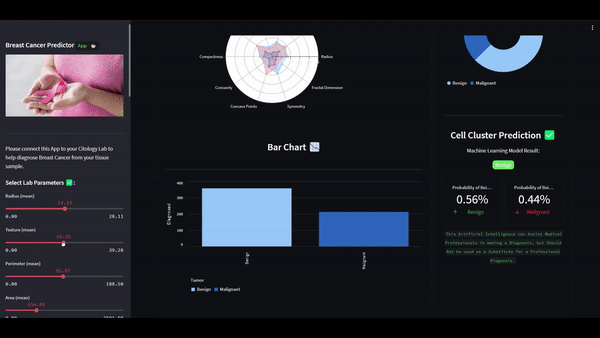

# Breast Cancer Predictor with Scikit Learn, Streamlit and Deployed with Flask and AWS


## Binary Classificator Breast Cancer Model with Scikit Learn, Streamlit, Flask and AWS

The Model was trained with Tabular Breast Cancer Data and with the `Logistic Regression` Scikit-Learn Architecture. The Model predicts if a given cell is either `Benign` or `Malignant`, also the U.I. to select the parameters of the cell was built with Streamlit and the API with Flask. Last, the Flask API was deployed on AWS EC2.


## Check-it out

Test it by running the `app.py` file, built with `Streamlit`, and the `api.py` file with `Flask`. Remember first to run the `api.py` file, copy the http url and saved in the API variable of the `app.py` file.

## Run
```sh
python3 api.py
```

```sh
streamlit run app.py
```



## Resources
- Breast Cancer Dataset: https://www.kaggle.com/datasets/uciml/breast-cancer-wisconsin-data
- Breast Cancer Predictor Preview: https://www.youtube.com/watch?v=OaPK7luz-4M
